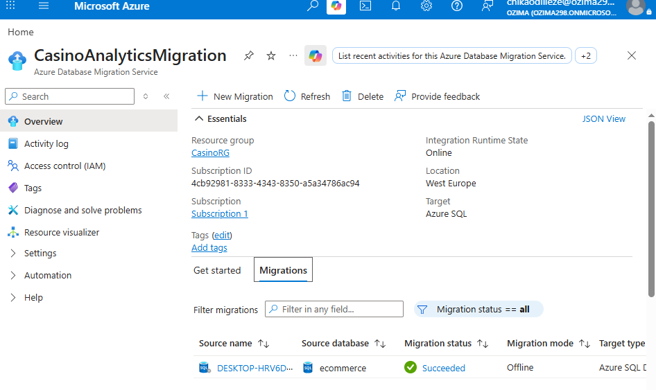
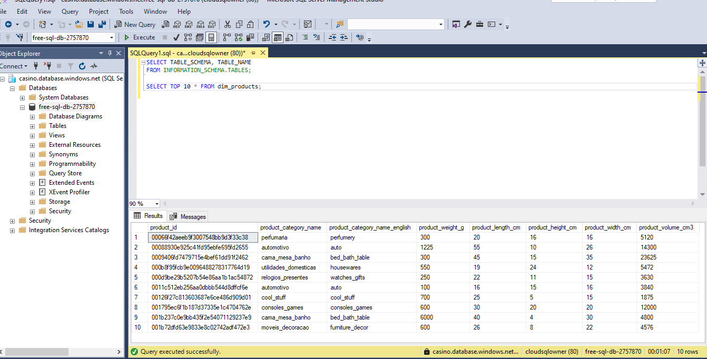

# 🎲 CasinoAnalytics Data Warehouse Project

## 📌 Project Overview
**Goal:** Develop a modern data pipeline for casino operations, covering ingestion, profiling, dimensional modeling, automation, and cloud migration.  
**Tech Stack:** SQL Server, Azure SQL Database, CSV datasets (Kaggle), Visual Studio Code (MSSQL extension), Power BI, Python.

---

## 📂 Data Ingestion
**Objective:** Load raw CSV datasets into SQL staging tables.  
**Process:**
- Designed staging tables (`Staging_Players`, `Staging_Games`, etc.).  
- Imported CSV data using `BULK INSERT` and `OPENROWSET`.  
- Validated row counts and schema consistency.  
**Outcome:** Raw casino data successfully ingested into SQL Server for transformation.

---

## 🔍 Data Profiling
**Objective:** Assess data quality and structure.  
**Process:**
- Checked for nulls, duplicates, and invalid values.  
- Generated summary statistics (row counts, distributions).  
- Documented profiling results for transparency.  
**Outcome:** Clean, reliable inputs prepared for analytics modeling.

---

## ⭐ Dimensional Modeling (Star Schema)
**Objective:** Build a schema optimized for analytics and BI.  
**Process:**
- Designed **Fact_GamePlay** table capturing bets, wins, and losses.  
- Created dimension tables (`Dim_Player`, `Dim_Game`, `Dim_Date`).  
- Documented schema with ERD diagrams.  
**Outcome:** A star schema ready for Power BI dashboards and advanced reporting.

---

## ⚙️ Automation
**Objective:** Keep the warehouse updated automatically.  
**Process:**
- Developed incremental update scripts (`INSERT` + `UPDATE`).  
- Wrapped SQL logic in `.bat` files using `sqlcmd`.  
- Scheduled daily execution with Windows Task Scheduler.  
- Added `ETL_Log` table to track row counts and run timestamps.  
**Outcome:** Fully automated ETL pipeline with monitoring and logging.

---

## ☁️ Cloud Migration
**Objective:** Scale the project to the cloud.  
**Process:**
- Migrated local SQL databases (e.g., `ecommerce`) to **Azure SQL Database** using Data Migration Service.  
- Configured Integration Runtime for secure ingestion.  
- Validated schema and data integrity post‑migration.  
**Outcome:** Cloud‑ready data warehouse accessible globally, enabling remote analytics.
---
## ☁️ Cloud Connection Proof (SSMS)

The screenshot below shows the **CasinoAnalyticsMigration** database live in the Azure Portal:

The ecommerce database was successfully migrated to **Azure SQL Database (Serverless Free tier)**.  
Below is a screenshot from **SQL Server Management Studio (SSMS)** showing query results directly from the cloud‑based server:

### Tables Available
- **Staging**: stg_orders, stg_customers, stg_order_items, stg_payments, stg_sellers, stg_products, stg_geolocation, stg_reviews  
- **Dimensions**: dim_products, dim_customers, dim_sellers, dim_date  
- **Facts**: fact_orders, fact_order_items, fact_payments, fact_reviews  

This schema supports advanced analytics and Power BI dashboards.

---

## 📊 Visualization & Analytics
**Objective:** Deliver actionable insights to casino management.  
**Process:**
- Connected Power BI directly to SQL schema.  
- Built dashboards for player retention, revenue per game, and churn analysis.  
- Developed DAX measures for KPIs (e.g., Average Bet Size, Monthly Revenue Growth).  
**Outcome:** Interactive dashboards providing real‑time insights into casino operations.

---

## 🐍 Python Integration (Planned)
**Objective:** Extend analytics with Python.  
**Future Work:**
- Use Pandas and SQLAlchemy for ETL and advanced analytics.  
- Automate reporting pipelines.  
- Integrate machine learning models for player segmentation and churn prediction.  

---

## 🔄 End-to-End Workflow
1. **Data Source** → Kaggle CSV datasets.  
2. **SQL Server** → Staging, profiling, and schema design.  
3. **Dimensional Model** → Fact and dimension tables.  
4. **Automation** → Batch + Task Scheduler.  
5. **Cloud Migration** → Azure SQL Database.  
6. **Visualization** → Power BI dashboards with DAX.  
7. **Advanced Analytics** → Python ETL + ML (planned).  

---

## 🚀 Business Value
- Provides casino management with **data‑driven insights** for decision‑making.  
- Enables **scalable cloud analytics** accessible remotely.  
- Supports **automation and monitoring**, reducing manual effort.  
- Lays foundation for **predictive analytics** with Python and Power BI.

