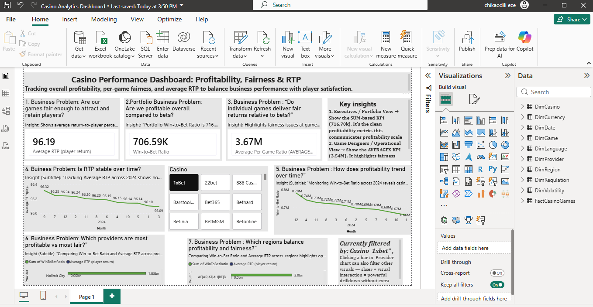

# Casino Analytics Executive Dashboard (Power BI)

## 📌 Business Problem
Casinos need to balance **profitability** with **fairness/compliance**.  
- **Profitability** is measured by the *Win-to-Bet Ratio*.  
- **Fairness** is measured by the *Average RTP (Return to Player)*.  
This dashboard helps stakeholders see trade-offs across providers and casinos.

---

## 🎯 Dashboard Design
- **Top Row KPIs**
  - Portfolio Win-to-Bet Ratio (SUM-based)
  - Average Win-to-Bet Ratio
  - Average RTP
- **Middle Row Line Charts**
  - RTP by Date
  - Win-to-Bet Ratio by Date
- **Bottom Row Bar Charts**
  - By Provider (Profitability vs Fairness)
  - By Casino/Region (Profitability vs Fairness)
- **Interactivity**
  - Casino slicer filters all visuals at once

---

## 🔍 Insights
- Providers and casinos can be compared side by side for **profitability vs fairness**.  
- High Win-to-Bet ratios indicate stronger margins, while higher RTP values reflect greater fairness to players.  
- The dashboard highlights trade-offs and helps identify outliers (e.g., casinos with unusually low RTP or high Win-to-Bet ratios).  

---

## 💡 Analyst Tips
- Use conditional formatting to flag casinos with RTP < 90% (compliance risk).  
- Sort visuals by Win-to-Bet or RTP to quickly spot leaders and laggards.  
- Planned to add drillthrough pages for deeper game-level analysis if needed.  
- Keep background clean (white/light) for professional readability.  

---

## 📸 Screenshot

---

## 🗂️ File
- `CasinoAnalytics.pbix` → Power BI dashboard file
---

## 📂 Note on Power BI File Size
The full Power BI `.pbix` file for this dashboard is larger than GitHub’s 25MB upload limit.  
For portfolio purposes, this repo includes the **README documentation** and **dashboard screenshot**.  
The complete `.pbix` file is available upon request.
